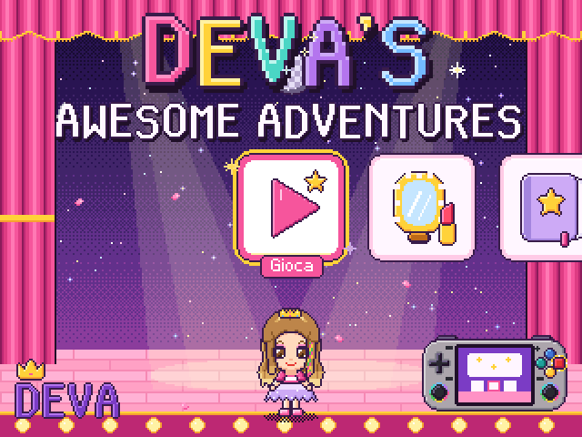
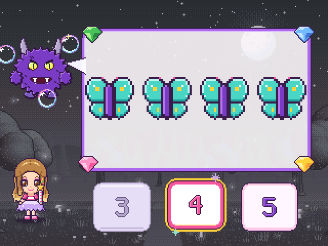
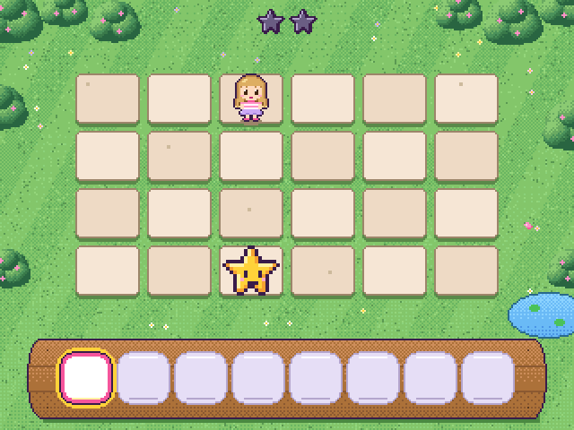

# Deva's Awesome Adventures

Un gioco educativo per bambini di cinque anni, in italiano e tutto a voce, per **RetroArch**: un core
libretro «senza contenuto» in C99, pensato per la console XiFan RF35H (RK3326) e per qualsiasi RetroArch
su Linux arm64 o x86_64. Lo stesso gioco anche **sul PC senza RetroArch**, in un programma a sé:
**Windows**, **macOS** e **Linux**, in una finestra o a schermo intero.

*English: [README.md](README.md).*

<p>



</p>

- **Diciotto giochi** con livelli da 1 a 5 che si adattano da soli e l'aiuto guidato dopo due errori:
  numeri, monete, misure, parole, lettere, forme, ombre, sequenze, ritmo, memoria, posizioni, emozioni,
  ballo, ginnastica, trucchi, primo coding.
- **Quattro avventure** con la mappa, le sfide e un gesto gentile che fa tornare buono il cattivo, poi una
  festa finale; camerino dei trucchi, album, tre profili.
- **Tutto a voce** (923 frasi): non serve saper leggere. Personaggi animati, musiche ed effetti originali.
- **A prova di bambina**: opzioni, salvataggi e uscita si aprono solo tenendo premuti L e R; sessioni a
  tempo che finiscono con la buonanotte; salvataggi che reggono uno spegnimento a metà.
- **Per i grandi**: un resoconto delle partite (`tools/report/report.py`) e il kit per la prima prova.
- Niente rete, pubblicità o acquisti: tutto resta sulla console o sul PC.

## Installare

I pacchetti sono nelle [release](https://github.com/debianita22/deva-adventures/releases), con
`SHA256SUMS` per controllarli:

| Pacchetto | Per |
| --- | --- |
| `deva-adventures-1.2.0-windows-x64-setup.exe` | **Windows 10 e 11** (64 bit): installazione per l'utente, senza amministratore |
| `deva-adventures-1.2.0-windows-x64.zip` | Windows 10 e 11 (64 bit), senza installare |
| `deva-adventures-1.2.0-macos.dmg` | **macOS** 10.13 o successivo, Apple Silicon e Intel |
| `deva-adventures-1.2.0-linux-x86_64.tar.gz` | **PC Linux senza RetroArch** (x86_64, glibc ≥ 2.17, SDL2 ≥ 2.0.9) |
| `deva-adventures-1.2.0-aarch64.zip` | console Linux arm64 con RetroArch (glibc ≥ 2.17) |
| `deva-adventures-1.2.0-x86_64.zip` | PC Linux con RetroArch (glibc ≥ 2.17) |
| `deva-adventures-1.2.0-src.tar.gz` | i sorgenti: devaOS (Buildroot), Lakka, altre architetture |

Su **Windows**: doppio clic sul `setup.exe`, Avanti, Fine (oppure si scompatta lo zip e si apre
`deva-adventures.exe`). Il programma non è firmato con un certificato a pagamento: la prima volta
Windows dice «Windows ha protetto il PC», poi *Ulteriori informazioni* → *Esegui comunque*.

Su **macOS**: si apre il `.dmg` e si trascina l'app in Applicazioni. L'app è firmata «ad hoc», non da
uno sviluppatore registrato da Apple: la prima volta macOS non la apre; *Impostazioni di Sistema* →
*Privacy e sicurezza* → *Apri comunque* (i dettagli nel `LEGGIMI.txt` del disco).

Sul **PC Linux**, senza RetroArch:

```sh
tar xzf deva-adventures-1.2.0-linux-x86_64.tar.gz
cd deva-adventures-1.2.0-linux-x86_64
./deva-adventures          # subito, in una finestra (F11: schermo intero)
./install.sh               # oppure installato: menu delle applicazioni, icona, comando deva-adventures
```

Sulla **console**, con RetroArch:

```sh
unzip deva-adventures-1.2.0-aarch64.zip
cd deva-adventures-1.2.0-aarch64
sh install.sh --dry-run    # mostra le cartelle e che cosa farebbe
sh install.sh              # copia di sicurezza, installazione, verifica dei file copiati
```

Poi in RetroArch: *Contentless Cores* → **Deva's Awesome Adventures**. Installazione a mano, devaOS,
Lakka, il PC senza RetroArch, aggiornamenti e ritorno alla versione di prima: capitoli 1, 2 e 13 del
manuale. I salvataggi sono gli stessi file su ogni sistema: si copiano dalla console al PC e ritorno.

## Documentazione

| | |
| --- | --- |
| [`docs/manuale.pdf`](docs/manuale.pdf) ([HTML](docs/manuale.html)) | il manuale per i genitori: installazione, giochi, avventure, opzioni, file, problemi e soluzioni |
| [`docs/playtest/scheda_osservazione.pdf`](docs/playtest/scheda_osservazione.pdf) | la prima prova: la guida per chi guarda e la scheda da stampare |
| [`docs/SVILUPPO.md`](docs/SVILUPPO.md) | compilare, provare, modificare e rilasciare: build, test, harness, grafica, audio, voce, architettura |
| [`CHANGELOG.md`](CHANGELOG.md) | le novità di ogni versione |
| [`THIRD_PARTY.md`](THIRD_PARTY.md) | i componenti di terzi e le licenze, voce compresa |
| [`packaging/`](packaging) | installazione per RetroArch, Linux, Windows e macOS, il pacchetto Buildroot (devaOS) e quello per Lakka |

## Compilare

```sh
make              # il core per il PC: build/host/deva_adventures_libretro.so
make linux        # il gioco per PC senza RetroArch: build/host/deva-adventures
make test         # 16 partite automatiche e i salvataggi interrotti
make test-linux   # il programma per PC su uno schermo virtuale, e il suo install.sh
make dist         # i pacchetti in release/ (con Zig: core aarch64 e x86_64, programmi per Linux e Windows)
make test-windows # il pacchetto per Windows sotto Wine
make mac          # su un Mac: il programma per Apple Silicon e Intel (poi tools/release/mkapp.sh)
```

La CI di GitHub (`.github/workflows/ci.yml`) fa tutto questo a ogni modifica, prova i pacchetti su
Windows e su un Mac veri e pubblica la release quando arriva un tag `vX.Y.Z` (oppure a mano:
*Actions → CI → Run workflow* su `main` con *release* spuntato). Requisiti, test su ARM
con qemu, sanitizer e tutto il resto: [`docs/SVILUPPO.md`](docs/SVILUPPO.md).

## Licenza

Il codice è sotto licenza MIT ([`LICENSE`](LICENSE)); disegni, musiche, storie e personaggi sono
originali, generati dagli script del repository. I pacchetti per Windows e macOS contengono SDL2
(licenza zlib, `LICENSE-SDL2.txt`).

**La voce** è sintetizzata offline con il modello Piper *it_IT-paola-medium*. Il suo dataset è CC0, ma
il modello è stato affinato a partire da *en_US-lessac-medium*, il cui corpus di addestramento è
concesso solo per la ricerca, senza ridistribuzione; se le frasi generate siano un'opera derivata di
quel corpus è discutibile. Per sostituire la voce: registrazioni in `data/voce/registrate/<id>.wav`
(vincono sulla sintesi) oppure le frasi rigenerate con un altro modello; vedi
[`THIRD_PARTY.md`](THIRD_PARTY.md).
